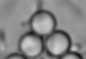
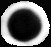

# corrTrack particle finding code
This code use the idea of image cross correlation to find particles in images. It works best when the particles to be found appear exactly the same. It requires an input image and a single particle mask to run.
## Sample images
(test_file/video.tif)
## Sample particle mask
(test_file/maski.tif)
## Comments
The white bright edges of the spherical particles are the most outstanding feature, so I choose a bright ring as the mask.
I wrote a ~messy~ document that describes the working principle of corrTrack, which can be found [here](corrTrack_doc.pdf).
## How to use
In ``corrTrack.py``, edit the following lines:
```python
    img = io.imread('video.tif')
    mask = io.imread('maski.tif')
    num_images = img.shape[0]
    num_particles = 3
    nTotal = 100
```
Indicate the full directories of ``img`` and ``mask``.
``num_particles`` is the total number of particles to be found in each frame.
``nTotal`` is the total number of frames to be analyzed.
