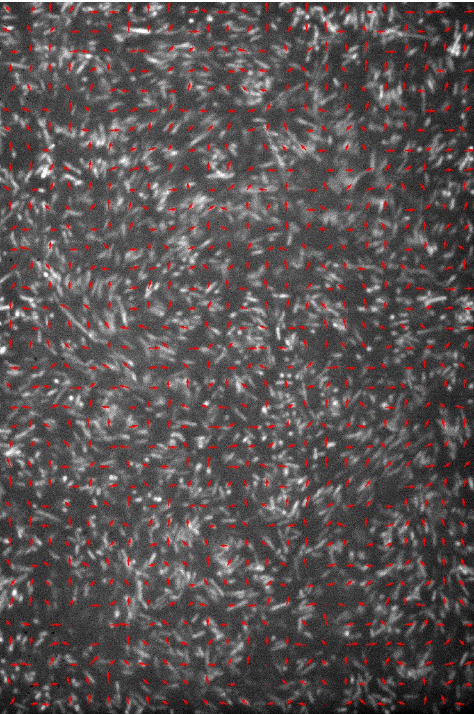
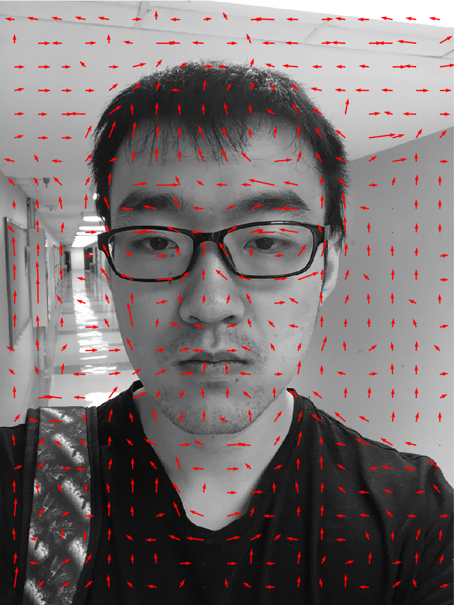

Get orientation of image by applying Fourier Transform.

Some examples of this analysis is shown below.

## Example 1: 2-D dense bacteria system

## Example 2: 3-D dense bacteria system

## Example 3: my photo

